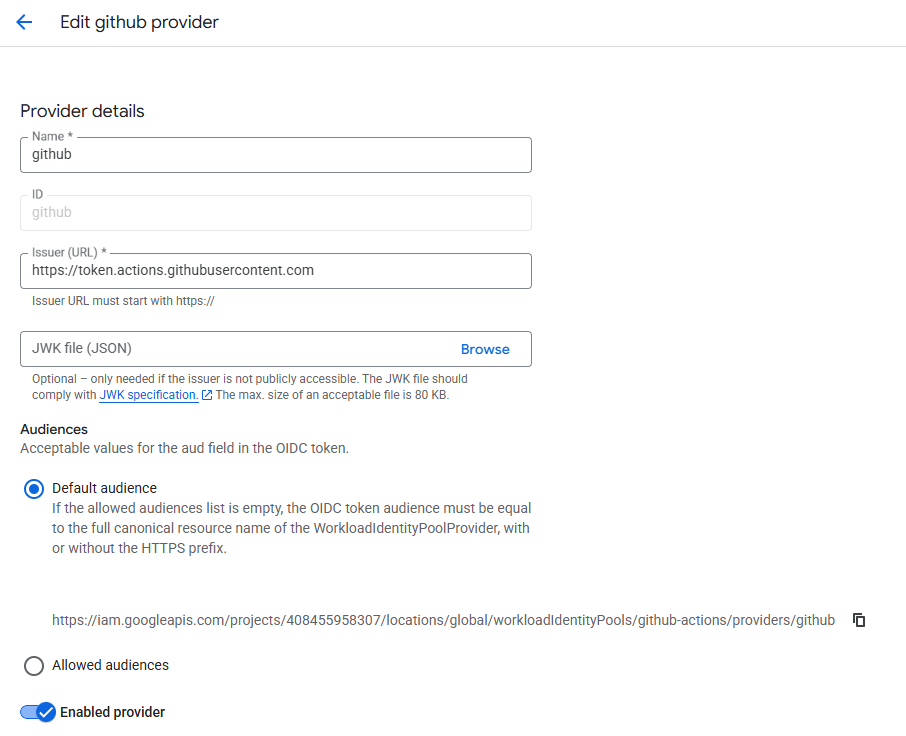
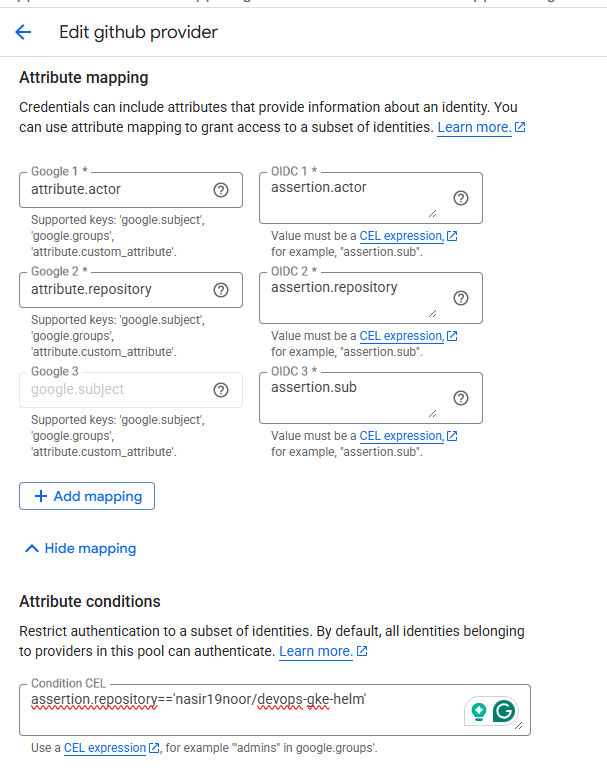

# DevOps GKE with Terraform and React Movie List Application
## GCP Workload Identity
### Step 1: Enable Requird APIs
```
gcloud services enable iamcredentials.googleapis.com
gcloud services enable cloudresourcemanager.googleapis.com
gcloud services enable iam.googleapis.com
```
### Step 2: Create a Service Account
Set Project ID
```
export PROJECT_ID="<your-gcp-project>"
export PROJECT_NUMBER="<project number>"
export REPO="<Your Repository>"
export SA_NAME="github-actions"
export SA_EMAIL="${SA_NAME}@${PROJECT_ID}.iam.gserviceaccount.com"
```
Create Service Account
```
gcloud iam service-accounts create ${SA_NAME} \
    --project=${PROJECT_ID} \
    --description="Service account for GitHub Actions Terraform deployments" \
    --display-name="GitHub Actions Terraform SA"
```

### Step 3: Grant Permissions to Service Account
Grant Necessary Roles for Terraform operation
```
gcloud projects add-iam-policy-binding ${PROJECT_ID} \
    --member="serviceAccount:${SA_EMAIL}" \
    --role="roles/editor"
```
```
gcloud projects add-iam-policy-binding ${PROJECT_ID} \
    --member="serviceAccount:${SA_EMAIL}" \
    --role="roles/storage.admin"
```
```
gcloud projects add-iam-policy-binding ${PROJECT_ID} \
    --member="serviceAccount:${SA_EMAIL}" \
    --role="roles/compute.admin"
```
```
gcloud projects add-iam-policy-binding ${PROJECT_ID} \
    --member="serviceAccount:${SA_EMAIL}" \
    --role="roles/iam.serviceAccountAdmin"
```
```
gcloud projects add-iam-policy-binding ${PROJECT_ID} \
    --member="serviceAccount:${SA_EMAIL}" \
    --role="roles/iam.serviceAccountTokenCreator"
```
```
gcloud projects add-iam-policy-binding ${PROJECT_ID} \
    --member="serviceAccount:${SA_EMAIL}" \
    --role="roles/iam.container.admin"
```
```
gcloud projects add-iam-policy-binding ${PROJECT_ID} \
    --member="serviceAccount:${SA_EMAIL}" \
    --role="roles/resourcemanager.projectIamAdmin"
```    

### Step 4: Create Workload Identity Pool
Set Variables
```
export POOL_ID="github"
export PROVIDER_ID="github"
```
Create workload identity pool
```
gcloud iam workload-identity-pools create ${POOL_ID} \
    --project=${PROJECT_ID} \
    --location="global" \
    --display-name="GitHub Actions Pool" \
    --description="Pool for GitHub Actions workflows"
```    

### Step 5: Create Workload Identity Provider

https://docs.github.com/en/actions/how-tos/security-for-github-actions/security-hardening-your-deployments/configuring-openid-connect-in-google-cloud-platform






### Step 6: Configure Service Account IAM Policy
Get the full provider name
Allow the GitHub Actions to impersonate the service account
```
gcloud iam service-accounts add-iam-policy-binding ${SA_EMAIL} \
    --project=${PROJECT_ID} \
    --role="roles/iam.workloadIdentityUser" \
    --member="principalSet://iam.googleapis.com/projects/${PROJECT_NUMBER}/locations/global/workloadIdentityPools/${POOL_ID}/attribute.repository/${REPO}"
```
```
gcloud iam service-accounts add-iam-policy-binding "${SA_EMAIL}" \
    --project="${PROJECT_ID}" \
    --role="roles/iam.workloadIdentityUser" \
    --member="principalSet://iam.googleapis.com/projects/${PROJECT_NUMBER}/locations/global/workloadIdentityPools/${POOL_ID}/attribute.repository/${REPO}"
```

### Step 7: Create Helm Chart Structure
```
cd gcp
helm create chart
```

helm install my-first-nginx ./chart
helm uninstall my-first-nginx ./my-nginx-chart
helm list
helm upgrade my-first-nginx ./chart

Check history:
```
helm history my-first-nginx
```

REVISION        UPDATED                         STATUS          CHART           APP VERSION     DESCRIPTION
1               Mon Jul 14 16:36:59 2025        superseded      chart-0.1.0     1.16.0          Install complete
2               Mon Jul 14 17:21:13 2025        deployed        chart-0.1.0     1.16.0          Upgrade complete

Rollback
```
helm rollback my-first-nginx 1
```
